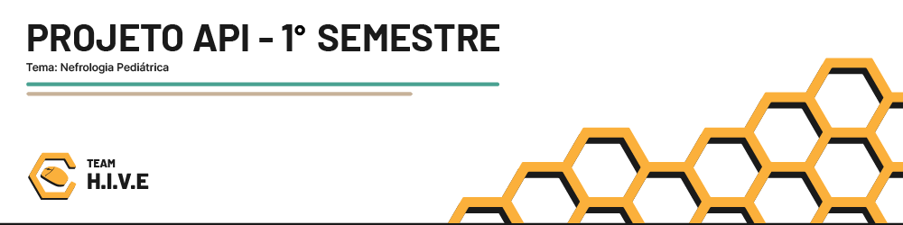
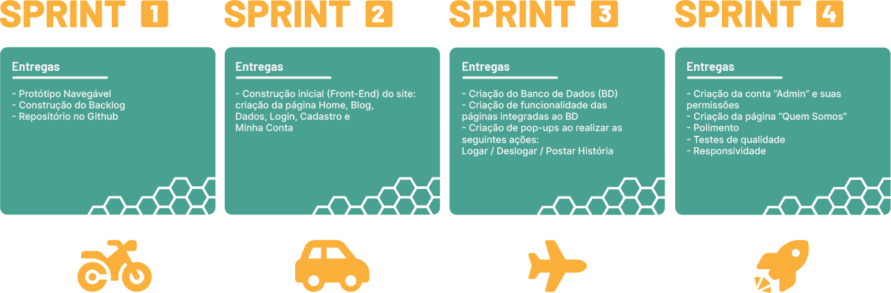

 

<a href ="#-sobre-o-projeto"> Sobre o Projeto </a> | 
<a href ="#-tecnologias-que-serão-utilizadas"> Tecnologias que serão utilizadas </a> |
<a href ="#-visão-do-produto"> Visão do Produto </a> |
<a href ="#-metodologia"> Metodologia </a> |
<a href ="#-mvps"> MVPs </a> |
<a href ="#-tutorial-de-execução-da-aplicação"> Tutorial de execução da Aplicação </a> |
<a href ="#-sprints"> Sprints </a> |
<a href ="#-backlog-do-produto"> Backlog do Produto </a> |
<a href ="#-time-de-desenvolvimento"> Time de Desenvolvimento </a>

 

## 📖 Sobre o Projeto

O objetivo desse projeto é criar um site informativo que conscientize a população brasileira sobre as dificuldades que os pais de crianças com Doença Renal Crônica (DRC) enfrentam para poder garantir um tratamento de qualidade, além de ajudar estes pais a procurarem por hospitais que cuidem de crianças com DRC e outros recursos que ajudem a lidar a raridade de meios de tratamento no Brasil.

 

## 💻 Tecnologias que serão utilizadas:

 

## 🔎 Visão do Produto

Criação de um site com função de conscientizar a população sobre o sofrimento das crianças com Insuficiência Renal Crônica (IRC). É possível adicionar histórias de pais na aba Blog e também visualizar dados sobre o assunto. O site apresenta as seguintes principais páginas:

<strong>Home: </strong> Introduz o assunto ao usuário e o encoraja a explorar o resto do site

<strong>Quem Somos: </strong> Introduz ao usuário o grupo de mães responsáveis pela iniciativa deste projeto (4º Sprint)

<strong>Blog: </strong> Mostra histórias sobre os pais de crianças com IRC. Informa-se ao usuário que ele pode submeter sua história

<strong>Dados: </strong> Mostra dados verídicos e pertinentes sobre o tema para o usuário

 

## 📋 Metodologia

O framework de Metodologia Ágil utilizado no produto foi o Scrum: um método ágil adaptativo, iterativo, flexível e eficaz. No Scrum, divide-se a tarefa em Sprints, no qual define-se as seguintes coisas:

<strong>1) MVPs: </strong> É a principal entrega de cada sprint. Prioriza-se as tarefas que trazem entrega de maior valor para o cliente.

<strong>2) Backlog de Produto: </strong> A partir das tarefas, contrói-se o Backlog de Produto, que passa pela aprovação do cliente.

<strong>3) Burndown Chart: </strong> Define-se a quantidade necessário de tempo para realizar cada tarefa, sendo divido, de maneira otimizada, aos desenvolvedores do Team H.I.V.E.

 

## 🏆 MVPs

 

<strong>Sprint 1: </strong>

 

<strong>Sprint 2: </strong>

 

<strong>Sprint 3: </strong>

 

<strong>Sprint 4: </strong> Em andamento ⌛

 

## 💻 Executando a Aplicação

<h3>Instale as Dependências</h3>

Para rodar a aplicação é necessário ter Git e o Python instalados no seu sistema.

Para baixar o Git, acesse <a href="https://git-scm.com/downloads">https://git-scm.com/downloads</a>.

Para baixar o Python, acesse <a href="https://www.python.org/downloads">https://www.python.org/downloads</a>.

<h3>Instale o MySQL</h3>

Siga as etapas abaixo para instalar o MySQL:

<ol>
    <li>Faça o download do MySQL Community Server a partir do seguinte link: <a href="https://dev.mysql.com/downloads/installer/">https://dev.mysql.com/downloads/installer/</a>.</li>
    <li>Siga as instruções para instalar o MySQL no seu sistema operacional.</li>
    <li>Durante o processo de instalação, você será solicitado a configurar uma senha para o usuário root. Anote a senha, pois você precisará dela mais tarde.</li>
    <li>Certifique-se de que o serviço MySQL esteja em execução antes de continuar com as etapas do tutorial.</li>
</ol>

<h3>Abra o Terminal</h3>

Pesquise por "Terminal" na barra de tarefas do seu dispositivo e abra o terminal.

<h3>Clone o Repositório no terminal</h3>
<pre><code>git clone https://github.com/TeamHiveAPI/API-2023.2.git</code></pre>

<h3>Entre na Pasta app e depois na pasta src</h3>
<pre><code>cd app</code></pre>
<pre><code>cd src</code></pre>

<h3>Crie o Ambiente Virtual</h3>
<pre><code>python -m venv venv</code></pre>
<pre><code>.\venv\Scripts\activate</code></pre>
<pre><code>cd src/</code></pre>
<pre><code>pip install -r requirements.txt</code></pre>

<h3>Para Usuários Linux</h3>
<pre><code>python3 -m venv venv</code></pre>
<pre><code>source venv/bin/activate</code></pre>
<pre><code>cd app/</code></pre>
<pre><code>pip install -r requirements_linux.txt</code></pre>

<h3>Configure o MySQL no Arquivo config.py</h3>

Abra o arquivo `config.py` localizado na pasta `src` e encontre a seguinte seção:

<pre><code>SECRET_KEY = 'timehive'

SQLALCHEMY_DATABASE_URI = \
 '{SGBD}://{usuario}:{senha}@{servidor}/{database}'.format(
     SGBD = 'mysql+mysqlconnector',
     usuario = 'root',
     senha = 'fatec',
     servidor = 'localhost:3306', 
     database = 'bd'
 )
</code></pre>

Altere o valor da chave `senha` para a senha do seu MySQL, caso ele for diferente de 'fatec'.

<h3>Execute a query no MySQL</h3>
<pre><code>create database bd;</code></pre>

<h3>Execute a Aplicação</h3>

Volte para o terminal e execute:

<pre><code>python controller.py</code></pre>

<h3>Abra o Link no Navegador</h3>

Abrir o seguinte link em seu navegador de preferência: <a href="http://127.0.0.1:5000">http://127.0.0.1:5000</a>

<h3>Encerrando o Ambiente Virtual</h3>
<pre><code>deactivate</code></pre>

 

## 📅 Sprints

 

 

| Sprint | Relatório | Status | 
| :----: | :--------: | :----------: |
| 1️⃣ | [Clique aqui](https://github.com/TeamHiveAPI/API-2023.2/tree/V1.0) | ✅ |
| 2️⃣ | [Clique aqui](https://github.com/TeamHiveAPI/API-2023.2/tree/V2.0) | ✅ |   
| 3️⃣ | [Clique aqui](https://github.com/TeamHiveAPI/API-2023.2/tree/V3.0) | ✅ |
| 4️⃣ | ⌛ | ⌛ |

 

## 🌱 Backlog do Produto

| Sprint | ID | Item | Prioridade | Descrição | Estimativa de Esforço | Status | Data Entrega | Critério de aceitação | Teste de aceitação | 
| :----: | :---: | :-----: | :-----: | :-------: | :---------------------: | :-----------: | :------------: | :------------: | :------------: |
| 1️ | 01 | Protótipo Navegável | 100 | Eu, como visitante, quero poder visualizar a introdução dos assuntos e dados que serão abordados na página home. | 5 horas | ✅ | 24/09 | Visualização da página Home no protótipo. | Protótipo Navegável
| 1️ | 01 | Protótipo Navegável | 95 | Eu, como visitante, quero poder ter acesso as demais páginas a partir de uma ferramenta de navegação. | 5 horas | ✅ | 24/09 | Navegação entre as páginas do site feita por uma ferramenta de navegação. | Protótipo Navegável
| 1️ | 01 | Protótipo Navegável | 90 | Eu,  como visitante, quero poder acessar a página a página “Blog” onde poderei conferir os relatos de pais e filhos com IRC. | 5 horas | ✅ | 24/09 | Visualização dos relatos com fotos e texto. | Protótipo Navegável
| 1️ | 01 | Protótipo Navegável | 85 | Eu, como visitante, quero poder mandar os meus relatos pessoais na página “Blog” com direito a anexar imagens. | 5 horas | ✅ | 24/09 | Postagem do relato pessoal do responsável  em formato de texto com a possibilidade de anexar imagens. | Protótipo Navegável
| 1️ | 01 | Protótipo Navegável | 80 | Eu, como visitante, quero poder acessar a página de dados e verificar quantas clínicas existem na minha região. | 5 horas | ✅ | 24/09 | Realização da filtragem no mapa para conferir quantas clínicas de nefropediatria existem na minha região. | Protótipo Navegável
| 1️ | 01 | Protótipo Navegável | 75 | Eu, como visitante, quero poder acessar a página de dados e verificar quantas crianças estão na fila esperando transplante na minha região. | 5 horas | ✅ | 24/09 | Realização da filtragem no mapa para saber quantas crianças estão na fila de transplante na minha região. | Protótipo Navegável
| 1️ | 01 | Protótipo Navegável | 70 | Eu, como visitante com conta cadastrada, quero poder acessar a página de login para acessar minha conta. | 5 horas | ✅ | 24/09 | Realização do login na página de login para o acesso da conta. | Protótipo Navegável
| 1️ | 01 | Protótipo Navegável | 65 | Eu, como visitante, quero poder acessar a página de cadastro para criar uma conta. | 5 horas | ✅ | 24/09 | Realização do cadastro na pagina de login para criar uma conta. | Protótipo Navegável
| 2 | 02 | Página "Home" | 60 | Eu, como visitante, quero acessar uma página “Home” para ser apresentado ao contexto e visão geral do site. | 4 horas | ✅ | 15/10 | Visualização da página Home, em html com css. | Página “Home”
| 2 | 02 | Página "Home" | 55 | Eu, como visitante, quero acessar um espaço de navegação entre páginas para os explorar o site por completo. | 4 horas | ✅ | 15/10 | Disponibilidade de um espaço de navegação visível em todas as páginas do site com inclusão de links para todas as páginas relevantes, mantendo uma ordem lógica dos links. | Página “Home”
| 2 | 03 | Página "Blog" | 50 | Eu, como visitante com conta cadastrada, quero poder postar meu relato com anexos de fotos segundo as instruções do site. | 4 horas | ✅ | 15/10 | Usuários registrados podem criar relatos que podem incluir anexos de fotos. | Página “Blog”
| 2 | 03 | Página "Blog" | 45 | Eu, como visitante, quero poder visualizar os relatos postados na página. | 4 horas | ✅ | 15/10 | Visualização dos relatos postados na páginas de forma clara e organizada, com informações legíveis sendo possível navegar pelos relatos e acessar detalhes adicionais, como fotos, por exemplo. | Página “Blog”
| 2 | 04 | Página "Dados" | 40 | Eu, como visitante, quero poder visualizar os dados apresentados na página. | 5 horas | ✅ | 15/10 | Visualização dos dados na páginas de forma clara e organizada. |  Página “Dados”
| 3 | 05 | Página "Login" | 35 | Eu, como visitante, quero poder fazer login ou efetuar meu cadastro no site. | 5 horas | ✅ | 05/11 | Efetuação do login ou se cadastrar no site, devendo solicitar informações relevantes para o cadastro, como e-mail e senha. | Página “Login”
| 3 | 06 | Página "Minha Conta" | 30 | Eu, como visitante cadastrado, quero poder visualizar as informações da minha própria conta. | 5 horas | ✅ | 05/11 | Visualização das informações de sua própria conta, sendo elas nome, e-mail e outras detalhes relevantes, que devem ser exibidas de forma clara e legível. | Página “Minha conta”
| 4 | 07 | Página "Quem somos" | 25 | Eu, como visitante, quero poder visualizar a página para entender melhor a motivação de quem está por trás da ideia principal do projeto, que nesse caso, são as mães com os filhos que possuem IRC. | 4 horas | ⌛ | 26/11 |  Deve oferecer um histórico detalhado sobre a motivação para a criação do site, incluindo experiências de mães com filhos com IRC. Deve conter perfis breves das mães que lideram o grupo, ressaltando suas experiências pessoais. | Página “Quem somos”
| 4 | 08 | Conta de Administrador | 20 | Eu, como administrador, poderei excluir posts para monitorar tudo o que é postado na página “Blog”, para evitar posts indevidos ou que ferem a integridade do site. | 5 horas | ⌛ | 26/11 |  A funcionalidade de exclusão de posts por um administrador no site requer um login exclusivo para administradores, permitindo acesso à lista de posts para seleção e remoção eficiente. Deve haver confirmação antes da exclusão e restrição da capacidade de exclusão apenas ao administrador para garantir controle e segurança no processo de exclusão de conteúdo. |  Login exclusivo de administrador.

 

## 👷🏻 Time de Desenvolvimento

| Foto | Nome | Função | Github | Linkedin |
| :---------: | :---------: | :---------------------: | :-----------------: | :-------: |
|  | Eber de Souza Silva Junior | Product Owner |  |  |
|  | Julia Maria Helbusto Rosado | Scrum Master |  |  |
|  | Marco Antonio Arantes | Desenvolvedor |  |  |
|  | Claudio Jayme Silva Diniz | Desenvolvedor |  |  |
|  | Erika Dias Ribeiro | Desenvolvedor |  |  |
|  | Elisa Rachel Beninca Martins | Desenvolvedor |  |  |
|  | Joyce Aparecida Pereira Silva | Desenvolvedor |  |  |
|  | Guilherme Luz Guimarães | Desenvolvedor |  |  |

