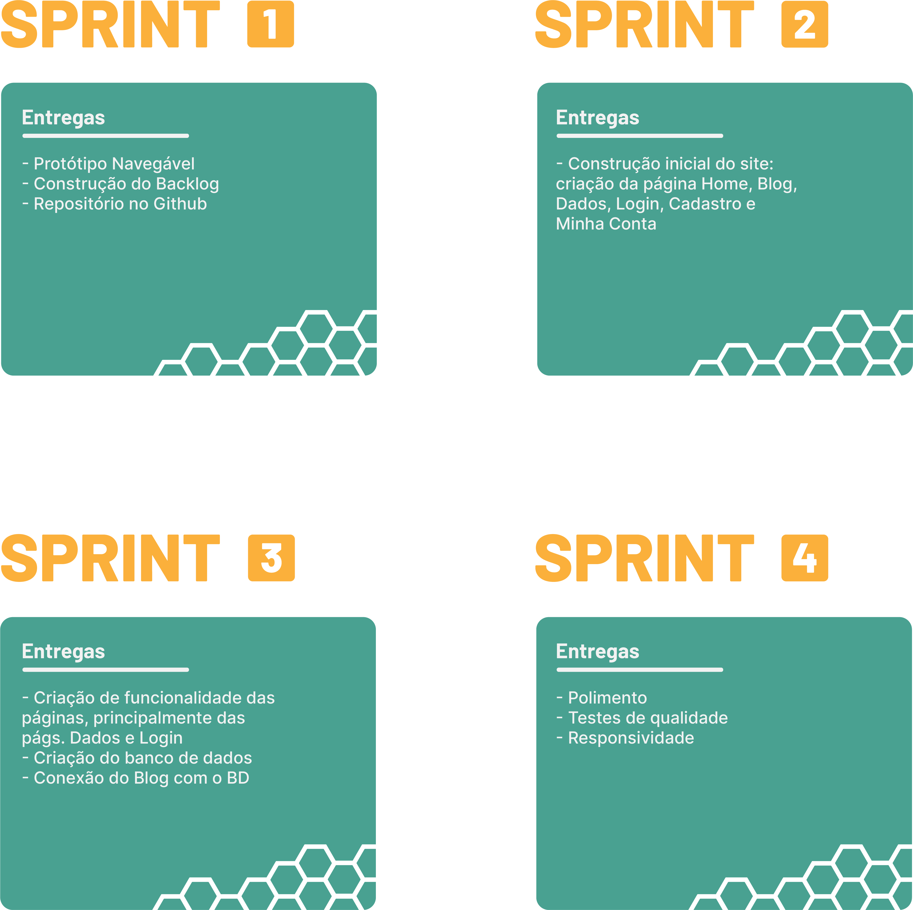

<br>

<div align="center">
<a href ="#-sobre-o-projeto"> Sobre o Projeto </a> | 
<a href ="#-tecnologias-que-serão-utilizadas"> Tecnologias que serão utilizadas </a> |
<a href ="#-visão-do-produto"> Visão do Produto </a> |
<a href ="#-metodologia"> Metodologia </a> |
<a href ="#-mvps"> MVPs </a> |
<a href ="#-tutorial-de-execução-da-aplicação"> Tutorial de execução da Aplicação </a> |
<a href ="#-sprints"> Sprints </a> |
<a href ="#-backlog-do-produto"> Backlog do Produto </a> |
<a href ="#-time-de-desenvolvimento"> Time de Desenvolvimento </a>
</div>

<br>

## 📖 Sobre o Projeto

O objetivo desse projeto é criar um site informativo que conscientize a população sobre o sofrimento que os pais passam para poder garantir um tratamento de qualidade para suas crianças com Insuficiência Renal Crônica (IRC), além de ajudar estes pais a procurarem por hospitais que cuidem de crianças com IRC, o que é relativamente raro.

<br>

## 💻 Tecnologias que serão utilizadas:

<div float=right>


</div>

<br>

## 🔎 Visão do Produto

O site necessita das seguintes principais páginas:

<strong>Home: </strong> Introduz o assunto ao usuário e o encoraja a explorar o resto do site

<strong>Blog: </strong> Mostra histórias sobre os pais de crianças com IRC. Informa-se ao usuário que ele pode submeter sua história

<strong>Dados: </strong> Mostra dados verídicos e pertinentes sobre o tema para o usuário

<br>

## 📋 Metodologia

O framework de Metodologia Ágil utilizado no produto foi o Scrum: um método ágil adaptativo, iterativo, flexível e eficaz. No Scrum, divide-se a tarefa em Sprints, no qual defini-se as seguintes coisas:

<strong>1) MVPs: </strong> É a principal entrega de cada sprint. Prioriza-se as tarefas que trazem entrega de maior valor para o cliente.

<strong>2) Backlog de Produto: </strong> A partir das tarefas, contrói-se o Backlog de Produto, que passa pela aprovação do cliente.

<strong>3) Burndown Chart: </strong> Define-se a quantidade necessário de tempo para realizar cada tarefa, sendo divido, de maneira otimizada, aos desenvolvedores do Team H.I.V.E.

<br>

## 🏆 MVPs

<div align="center">

</div>

<br>

<strong>Sprint 1: </strong> [Protótipo Navegável](https://www.figma.com/proto/oAzPuq5XfHFBd72A0mbcSP/Site-Rim?type=design&node-id=1-2&t=F6lUhn9fDnYq07iA-0&scaling=min-zoom&page-id=0%3A1&starting-point-node-id=1%3A2)

<strong>Sprint 2: </strong> Em andamento ⌛

<strong>Sprint 3: </strong> Em andamento ⌛

<strong>Sprint 4: </strong> Em andamento ⌛

<br>

## 💻 Tutorial de execução da Aplicação

```
O tutorial será publicado na última sprint.
```

<br>

## 📅 Sprints

| Sprint | Relatório | Status | 
| :----: | :--------: | :----------: |
| 1️⃣ | [Clique aqui](/redirecionar-depois) | ✅ |
| 2️⃣ | ⌛ | ⌛ |   
| 3️⃣ | ⌛ | ⌛ |
| 4️⃣ | ⌛ | ⌛ |

<br>

## 🌱 Backlog do Produto

| Sprint | ID | Prioridade | Item | Descrição | Status |
| :----: | :---: | :-----: | :-----: | :-------: | :---------: |
| 1️⃣ | 01 |  |  | O backlog está em construção!  |  |
| 1️⃣ | 02 |  |  |  |  |
| 1️⃣ | 03 |  |  |  |  |

<br>

## 👷🏻 Time de Desenvolvimento

| Nome | Função | Github | Linkedin |
| :---------: | :---------: | :---------------------: | :-----------------: |
|  Eber de Souza Silva Junior | Product Owner  | <a href="https://github.com/eberssj"></a> | <a href="https://www.linkedin.com/in/eber-junior-b2a4a3211/"></a> |
| Julia Maria Helbusto Rosado | Scrum Master | <a href="https://github.com/juliamariahr"></a> | <a href="https://www.linkedin.com/in/j%C3%BAlia-rosado/"></a> |
| Marco Antonio Arantes | Desenvolvedor | <a href="https://github.com/maarantes"></a> | <a href="https://www.linkedin.com/in/marco-antonio-arantes/"></a> |
| Glória Felix de Brito | Desenvolvedor | <a href="https://github.com/globrito"></a> | <a href="https://www.linkedin.com/in/gloriafbrito/"></a> |
| Edson Diogo Frutuoso | Desenvolvedor | <a href="https://github.com/Edsonfrutuoso"></a> | <a href="www.linkedin.com/in/edsonfrutuoso"></a> |
| Claudio Jayme Silva Diniz | Desenvolvedor | <a href="https://github.com/ClaudioJaymeDiniz"></a> | <a href="https://www.linkedin.com/in/claudio-jayme-silva-diniz-463858236"></a> |
| Erika Dias Ribeiro | Desenvolvedor | <a href="https://github.com/erikadias2004"></a> | <a href="https://www.linkedin.com/in/erika-dias-ribeiro-608359266"></a> |
| Lucas Gabriel Soares Lopes | Desenvolvedor | <a href="https://github.com/LucasGabrielLopes"></a> | <a href="https://www.linkedin.com/in/lucas-gabriel-soares-lopes-a29228263/"></a> |
| Joyce Aparecida Pereira Silva | Desenvolvedor | <a href="https://github.com/joycesilvaaa"></a> | <a href="https://www.linkedin.com/in/joyce-silva-79a4b9287"></a> |
